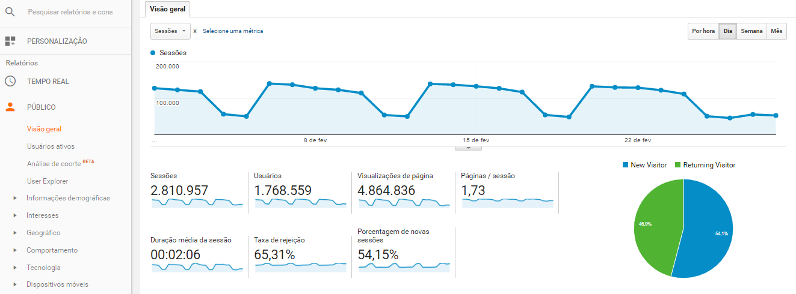
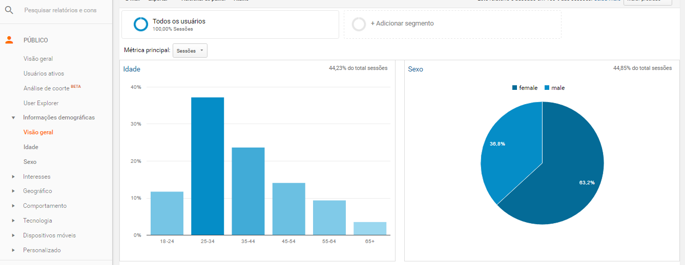
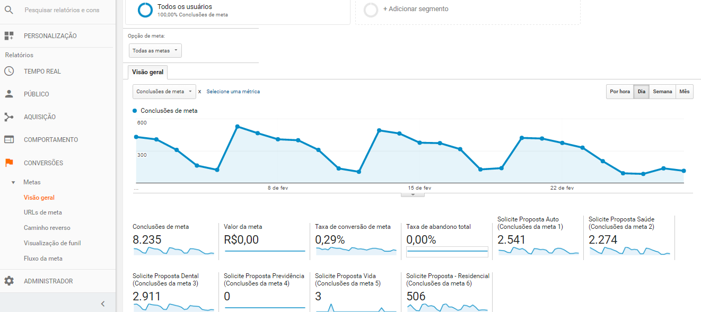

# google-analytics
5 basic reports you need to know about

For everyone who have a website: you should be using [Google Analytics.](https://analytics.google.com/)

Google Analytics is a total free plataform who will help you to improve your website performance. 

#How am I used the Google Analytics on my website?
  You need to add a little bit of code to your webpages, and you don't need to be a Developer. 
The basic steps:
  - [x] Set up a Google Analytics account
  - [x] Log in and [set up a property](https://support.google.com/analytics/answer/1042508) for your website based on the instructions provided.
  - [x] Google Analytics will provide you with a [tracking ID](https://support.google.com/analytics/answer/1008080) that you’ll need to add to the code of the webpages on your website.
  [You can read and leard more about that, here.](https://developers.google.com/analytics/)
  
Well, all done.
Now, we will see the 5 basics reports that you need to know about!

## 1. Website Traffic 
  When you do your login into Google Analytics you'll see your basic traffic information and performance in the Reporting dashboard.

These metrics reveal a basic level how well your website is performing, no matter what type of website you have, these metrics tell you to what degree that’s happening:

- Sessions: How many total visits people have made to your website
- Users: How many of them are new visitors
- Pageviews: How many pages have beem visited
- Pages/Session: Average pageviews per session
- Avg. Session Duration: How long people usually spend time on your site once they get there
- Bouce Rate: Percentage of when there are no interactions with your page
- % New Visitors: Percentage of new unic visitors 

## 2. Demographics
  Still inside "Public", you'll see the Demographic informations about your website.
  
  
  
Agrouping all your users, here, you can confirm:

- Age
- Sex

These metrics reveal if the audience you’re meaning to reach is the one you’re actually getting. This will help you when you do some campaigns with Facebook Ads or Google Ads, for example. 
You can check in the left sidebar some metrics that will help you to check what your audience's interests are, their behavior, the location, the devices they use, etc.

## 3. Traffic Source
  Here you can see how visitors found you.

 
 
This section gives you an idea of how well your [SEO](http://searchengineland.com/guide/what-is-seo) will doing, your social media, e-mail marketing, and "Others" things that Google can't capture from browsers. 
Knowing who are your public and what they "like to do", also helps you determine how important having a marketing strategy is. 
If your percentage of mobile users are relevant, you **need** to do a resposive website. 
  
  ## 4. Real Time
    As the name already speaks, you can see what your visitors are doing in real time. 
    
 
 
The Real Time makes you understand which topics and content types your visitors respond to the most in order to strengthen your strategy moving forward.
And you can monitoring:

- General Dashboard
- Locals
- Traffic
- Behavior
- Events
- Conversions

## 5. Converions Rates
  Finally, but most important, the conversions that your users brings to your website. 
  

You can check with Google what your [main conversion goals](https://support.google.com/analytics/answer/1032415?hl=en) are for the website, and even how much each goal is worth to you. Then a Conversions section will appear next to Acquisitions and Behavior.
Particularly if you have an online store, you'll need a conversion pixel to know how your users are interacting, buying, and finalizing your purchases on your site.

## Not done yet...
  Google are the best plataform to improve your website and make the bests analysis with the results. 
  
Remember, these points are just the **basic** reports that you need to know. So, if i was you, i'll read and learn more about what Google can do for you and for your website, it's incredible!

  

